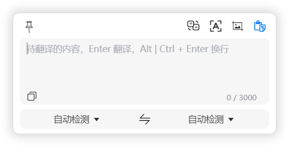
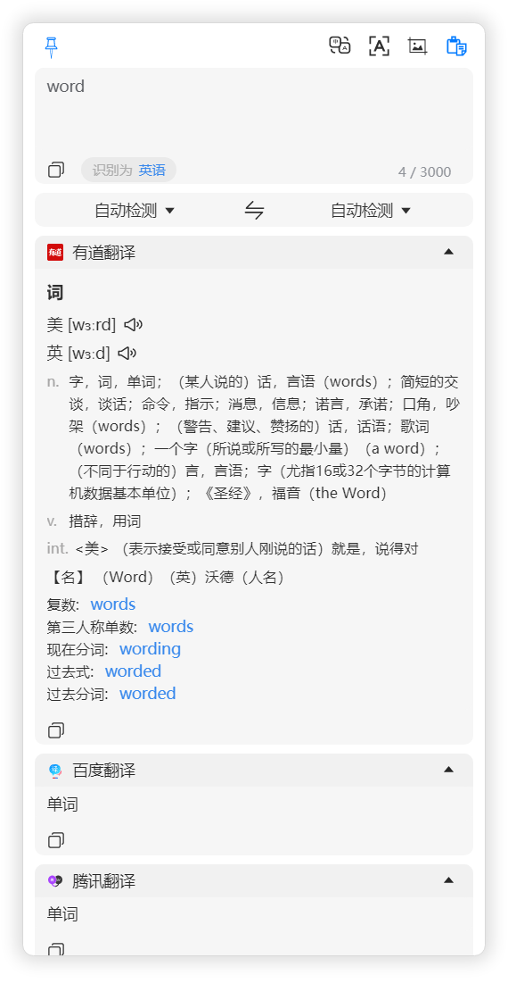

# Bob for Electron

Bob for Electorn是一款仿[Bob](https://bobtranslate.com/)的OCR、翻译、取色工具，使用Electron、Vite、Vue3、Element-Plus开发。

图片识别、翻译功能可仅使用自建服务（paddocr + meta-ai fairseq nllb），所有代码完全开源，请自行编译使用

## 截图






## 已接入的OCR

* [PaddleOCR](https://github.com/PaddlePaddle/PaddleOCR) 识别率还行，关键是docker部署在自己的服务器，比较放心
  ```bash
  docker run --name ppdocr -p 8866:8866 -d drainkeng/paddleocr:2.6-cpu-latest
  ```
* [百度文字识别OCR](https://cloud.baidu.com/doc/OCR/index.html) 用Bob的时候就充过值，总不能不用了吧...

## 已接入语种识别

* unicode识别，不涉及语义，勉强能用
* [Google Cloud Translation API detect](https://cloud.google.com/translate/docs/basic/detecting-language)
* [腾讯云 语种识别](https://cloud.tencent.com/document/api/551/15620) 这个是免费的还是和文本翻译共用免费额度不太清楚...
* 默认使用自动模式： 腾讯云 -> Google -> unicode，要快的话直接换unicode

## 已接入文本翻译

* [有道翻译](https://ai.youdao.com/DOCSIRMA/html/%E8%87%AA%E7%84%B6%E8%AF%AD%E8%A8%80%E7%BF%BB%E8%AF%91/API%E6%96%87%E6%A1%A3/%E6%96%87%E6%9C%AC%E7%BF%BB%E8%AF%91%E6%9C%8D%E5%8A%A1/%E6%96%87%E6%9C%AC%E7%BF%BB%E8%AF%91%E6%9C%8D%E5%8A%A1-API%E6%96%87%E6%A1%A3.html) 查词时还是很有用的
* [百度通用翻译](http://api.fanyi.baidu.com/doc/21) 高级版100万字符免费额度
* [Google Cloud Translation API v2](https://cloud.google.com/translate/docs/basic/translating-text?hl=zh-cn) v2版本够用了，每月50万字符免费额度
* [腾讯云 文本翻译](https://cloud.tencent.com/document/api/551/15619) 500万字符免费额度
* [微信翻译](https://developers.weixin.qq.com/doc/offiaccount/Intelligent_Interface/AI_Open_API.html) 为了接入还注册了个小程序，没提收费的事，但API只支持中英互转
* [Openl](https://docs.openl.club/#/API/translate) 免费额度太少，作为补充勉强可以用用
* [彩云小译](https://open.caiyunapp.com/%E4%BA%94%E5%88%86%E9%92%9F%E5%AD%A6%E4%BC%9A%E5%BD%A9%E4%BA%91%E5%B0%8F%E8%AF%91_API) 100万字符免费额度，支持中英日互译
* [Facebook MetaAI Flores200](https://github.com/facebookresearch/fairseq) docker自建服务，免费，效果还不错，就是对机器配置稍高点

```bash
# 用了 https://github.com/rosasalberto/automatic_translation_server
docker run --name trans -d -p 8080:8080 rosasalberto/translation-service
# 镜像有点大，启动完成后访问http://localhost:8080/docs	
 ```

* [F搜翻译](https://fsoufsou.com/translate) 没API，抓的包...

## 配置文件

* ### 自己申请接口后修改这部分，涉及到各种密钥，我就不提交这个文件了
* ### 路径在electron/lib/config.ts
* ### 不加没法运行!!!!

```typescript
import { IConfig } from '../../types'
import { Language } from '../../global'

const services = [
	{ zh: '谷歌翻译', en: 'google' },
	{ zh: '有道翻译', en: 'youdao' },
	{ zh: '彩云小译', en: 'caiyun' },
	{ zh: '微信翻译', en: 'wechat' },
	{ zh: 'DeepL', en: 'deepl' },
	{ zh: '腾讯翻译君', en: 'tencent' },
	{ zh: '阿里翻译', en: 'aliyun' },
	{ zh: '百度翻译', en: 'baidu' },
	{ zh: '搜狗翻译', en: 'sogou' },
	{ zh: 'Azure 翻译', en: 'azure' },
	{ zh: 'IBM Watson', en: 'ibm' },
	{ zh: 'Amazon 翻译', en: 'aws' }
]

export default {
	init: false,
	pinup: false,
	position: 'right-top',    // 习惯在右上角打开，不加功能了
	lang_testing: 'auto',
	current_ocr: 'paddocr',
	ocr_clipboard: true,
	ocr: [
		{
			enable: true,
			name: 'baidu',
			label: '百度通用场景文本识别',
			ui: [
				{ name: 'enable', label: '是否启用', type: 'switch' },
				{ name: 'client_id', label: '客户端编号(client_id)', type: 'password', required: true },
				{ name: 'client_secret', label: '客户端密钥(client_secret)', type: 'password', required: true },
				{ name: 'type', label: '接口类型', type: 'select', options: ['高精度', '高精度含坐标', '标准', '标准含坐标'] },
				{ name: 'detect_direction', label: '自动检查方向', type: 'switch' }
			],
			token_url: 'https://aip.baidubce.com/oauth/2.0/token?grant_type=client_credentials',
			url: 'https://aip.baidubce.com/rest/2.0/ocr/v1/',
			client_id: '填你自己申请的',
			client_secret: '填你自己申请的',
			detect_direction: true,
			type: '标准' as '高精度' | '高精度含坐标' | '标准' | '标准含坐标', //没有实现根据坐标还原文本格式
			type_action: {
				标准: 'general_basic',
				标准含坐标: 'general',
				高精度: 'accurate_basic',
				高精度含坐标: 'accurate'
			}
		},
		{
			enable: true,
			name: 'paddocr',
			label: '飞桨OCR - 自建',
			ui: [
				{ name: 'enable', label: '是否启用', type: 'switch' },
				{ name: 'url', label: '接口地址', type: 'input', required: true }
			],
			url: 'https://你自己的服务器地址/api/v2/paddocr'
		}
	],
	translate: [ // 调整此处顺序可改变页面显示顺序，也可自行实现相关排序逻辑
		{
			enable: true,
			name: 'youdao',
			label: '有道翻译',
			ui: [
				{ name: 'enable', label: '是否启用', type: 'switch' },
				{ name: 'appKey', label: '应用ID', type: 'password', required: true },
				{ name: 'key', label: '应用密钥(key)', type: 'password', required: true }
			],
			url: 'http://openapi.youdao.com/api',
			appKey: '填你自己申请的',
			key: '填你自己申请的'
		},
		{
			enable: true,
			name: 'baidu',
			label: '百度翻译',
			ui: [
				{ name: 'enable', label: '是否启用', type: 'switch' },
				{ name: 'appid', label: '应用编号(appid)', type: 'password', required: true },
				{ name: 'secret', label: '应用密钥(secret)', type: 'password', required: true }
			],
			url: 'https://fanyi-api.baidu.com/api/trans/vip/translate',
			appid: '填你自己申请的',
			secret: '填你自己申请的'
		},
		{
			enable: true,
			name: 'google',
			label: '谷歌翻译',
			zh2en_enable: true,
			ui: [
				{ name: 'enable', label: '是否启用', type: 'switch' },
				{ name: 'url', label: '访问地址(URL)', type: 'input', required: true },
				{ name: 'projectId', label: '项目编号(projectId)', type: 'password', required: true },
				{ name: 'apiKey', label: 'Api Key', type: 'password', required: true }
			],
			url: 'https://你自己的服务器地址/api/v2/google/trans',
			projectId: '填你自己申请的',
			apiKey: '填你自己申请的'
		},
		{
			enable: true,
			name: 'tencent',
			label: '腾讯翻译',
			ui: [
				{ name: 'enable', label: '是否启用', type: 'switch' },
				{ name: 'secretId', label: 'secretId', type: 'password', required: true },
				{ name: 'secretKey', label: 'secretKey', type: 'password', required: true }
			],
			url: 'tmt.tencentcloudapi.com',
			region: 'ap-chengdu',
			secretId: '填你自己申请的',
			secretKey: '填你自己申请的'
		},
		{
			enable: true,
			name: 'metaAI',
			label: 'Facebook Meta AI - 自建',
			ui: [{ name: 'enable', label: '是否启用', type: 'switch' }],
			url: 'https://你的服务器地址/api/v2/meta-ai'
		},
		{
			enable: true,
			name: 'wechat',
			label: '微信翻译',
			ui: [
				{ name: 'enable', label: '是否启用', type: 'switch' },
				{ name: 'appid', label: 'appid', type: 'password', required: true },
				{ name: 'secret', label: 'secret', type: 'password', required: true }
			],
			url: 'https://api.weixin.qq.com/cgi-bin',
			appid: '填你自己申请的',
			secret: '填你自己申请的'
		},
		{
			enable: true,
			name: 'caiyun',
			label: '彩云小译',
			ui: [
				{ name: 'enable', label: '是否启用', type: 'switch' },
				{ name: 'token', label: 'token', type: 'password', required: true }
			],
			url: 'http://api.interpreter.caiyunai.com/v1/translator',
			token: '填你自己申请的'
		},
		{
			enable: true,
			name: 'fsou',
			label: 'F搜翻译',
			ui: [
				{ name: 'enable', label: '是否启用', type: 'switch' }
			],
			url: 'https://fsoufsou.com/search-engine-listing/v1/dictionary/translate'
		},
		{
			enable: false,
			name: 'openl',
			label: 'OpenL',
			ui: [
				{ name: 'enable', label: '是否启用', type: 'switch' },
				{ name: 'apikey', label: 'apikey', type: 'password', required: true },
				{
					name: 'use_services', label: '服务', type: 'select', multi: true, options: services.map(x => {
						return { label: x.zh, value: x.en }
					})
				}
			],
			url: 'https://api.openl.club/group/translate',
			apikey: '填你自己申请的',
			services: services,
			use_services: ['deepl']
		}
	],
	languages: [
		{ name: Language.中文, default: 'zh', fsou: 'Chinese', wechat: 'zh_CN', youdao: 'zh-CHS', metaAI: 'zho_Hans' },
		{ name: Language.英语, default: 'en', fsou: 'English', wechat: 'en_US', metaAI: 'eng_Latn' },
		{ name: Language.日语, default: 'ja', fsou: 'Japanese', wechat: '-', metaAI: 'jpn_Jpan' },
		{ name: Language.韩语, default: 'ko', fsou: 'Korean', baidu: 'kor', openl: '-', caiyun: '-', wechat: '-', metaAI: 'kor_Hang' },
		{ name: Language.俄语, default: 'ru', fsou: 'Russian', caiyun: '-', wechat: '-', metaAI: 'rus_Cyrl' },
		{ name: Language.德语, default: 'de', fsou: 'German', caiyun: '-', wechat: '-', metaAI: 'deu_Latn' },
		{ name: Language.法语, default: 'fr', fsou: 'French', baidu: 'fra', caiyun: '-', wechat: '-', metaAI: 'fra_Latn' }
	]
} as IConfig
```

## ......啰嗦几句

* 因工作原因切换至windows平台，少了[PopClip](https://pilotmoon.com/popclip/) + [Bob](https://bobtranslate.com/).怎么都觉得不对劲
* 网上能找到的类似的工具我都试了一遍，没一个能让我满意的，趁过年有点时间自己仿一个
* 一开始c#做的版本叫Bob for Windows，界面太丑了，我自己都看不下去，不放出来献丑了
* 换到Electron又没法解决截图、取色问题(原本是调的qq CameraDll.dll)，github上找到了[ShareX](https://github.com/ShareX/ShareX).能满足我的需求，但是太重了，精简一番后也开源了[ShareX](https://github.com/hlxxzt/ShareX).截图界面"h"键取色
* 飞桨OCR部署完成后的地址是host:port/predict/ocr_system.我自己代理了一层到cdn，要用的话记得改成你自己的url
* openl我默认禁用了，免费额度太少，应急用吧，反正很多是重合的，不重合的效果也不是很理想
* google api调用是自己撸了个[express api google-cloud-api-server](https://github.com/hlxxzt/google-cloud-api-serve).部署在hk服务器上用的，也有其他方案，比如：Cloudflare Workers、走镜像站、改hosts
* google的免费额度比较少，单独加了层仅中转英时才使用的逻辑
* fairseq需要自己部署，docker部署很简单，但对配置要求有些高，不一定要GPU，8U 8G的话速度还行，我没用docker，但接口我适配了docker版的，对了，记得改url
* fairseq docker部署完成后语种支持不全，需要改容器中的/app/config.py translation_langs，修改为translation_langs = ["eng_Latn", "fra_Latn", "zho_Hans", "kor_Hang", "jpn_Jpan", "deu_Latn", "rus_Cyrl"]
* 只支持了部分语言，有需要的自己加，文末有各平台语言编码对照链接
* 项目中的build/ShareX.exe是我编译的，不放心的可以用我精简过的ShareX编译后替换掉就行
* 设计了配置界面的dom生成规则，要和家人出去几天就懒得继续写了
* 只使用了常用的包，理论都能自己打包出来
* 要搭配[AutoHotKey 2.0](https://autohotkey.com).食用效果最佳，划词用的Snip.Do PRO，加了个快捷键文本扩展(ctrl + alt + shift + f12
* AutoHotKe有C#替代品, [keysharp](https://bitbucket.org/mfeemster/keysharp) . 但没法触发alt + LButton -> ctrl + LButton，代码中大片注释，看着心累，懒得集成了
* 理论上electron用ffi也能替代掉autohotkey，但这个打包对不熟悉的人来说有点痛苦，性能也是问题，就算了吧
* 其实用tauri或者wails来做性能、打包后的体积会更好，能解决本地化调用的问题，一个程序完成屏幕取词、键盘映射、截图取色、翻译。但轮子太少，以后有时间在说吧

## Autohotkey 2.0脚本

```autohotkey
;-----------------------------------------
; Mac keyboard to Windows Key Mappings
;=========================================
; ! = ALT
; ^ = CTRL
; + = SHIFT
; # = WIN
title := "Mac键盘映射"

#HotIf WinActive("ahk_exe webstorm64.exe") == 0 ; webstorm我有套自己的键盘映射，所以过滤掉 
$!c::Send "^c"     ;alt + c -> ctrl + c
$!x::Send "^x"     ;alt + x -> ctrl + x
$!v::Send "^v"     ;alt + v -> ctrl + v
$!a::Send "^a"     ;alt + a -> ctrl + a
$!s::Send "^s"     ;alt + s -> ctrl + s
$!w::              ;alt + w -> ctrl + w | ctrl + alt + z | esc
{
	; 如果是微信的话
	if (WinActive("ahk_exe WeChat.exe") != 0) {
		;   如果是微信的图片打开
		if (WinActive("ahk_class ImagePreviewWnd") != 0) {
			Send "{esc}" ;按esc
		} else {
			Send "^!z" ;ctrl + alt + z
		}
	} else {
		Send "^w" ;ctrl + w
	}
	Return
}

; 主要是chrome里切换标签页用的
$!1::Send "^1"
$!2::Send "^2" 
$!3::Send "^3" 
$!4::Send "^4" 
$!5::Send "^5" 
$!6::Send "^6" 
$!7::Send "^7" 
$!8::Send "^8" 
$!9::Send "^9"

$!z::Send "^z"     ;alt + z -> ctrl + z 

$!+z::             ;chrome恢复上次关闭的页面 alt + shift + z -> ctrl + shift + t 
{
	if (WinActive("ahk_exe chrome.exe") != 0) {
		Send "^+t"
	}
	Return
}

$!r::Send "^r"     ;chrome刷新页面 alt + r -> ctrl + r
$!t::Send "^t"     ;alt + t -> ctrl + t
$!q::Send "!{F4}"  ;alt + q -> alt + F4
$!f::Send "^f"     ;alt + f -> ctrl + f
$!LButton::Send "^{Click Left}"  ;alt + 鼠标左键 -> ctrl + 鼠标左键
$!Backspace::Send "{Delete}"     ;alt + c -> delete
$!Left::Send "{Home}"            ;alt + 方向键左 -> Home键
$!Right::Send "{End}"            ;alt + 方向键右 -> End键
$!+Left::Send "+{Home}"          ;alt + shift + 方向键左 -> shift + Home键
$!+Right::Send "+{End}"          ;alt + shift + 方向键右 -> shift + End键
#HotIf

$^!+F12::                        ;给Snip.Do调用的
{
	Send "^c"
	Send "^+{F3}"
	Return
}

A_MenuMaskKey := "vkFF"
#UseHook
#a::
{
	KeyWait "LWin"
	Send "^+{F1}"                 ;输入翻译 win + a -> ctrl + shift + f1
	Return
}
#s::
{
	KeyWait "LWin"
	Send "^+{F2}"                 ;ocr翻译 win + s -> ctrl + shift + f2 
	Return
}
#d::                              ;要硬说成划词翻译也不是不行 win + d -> ctrl + shift + f3
{
	KeyWait "LWin"
	Send "^c"
	Send "^+{F3}"
	Return
}
#HotIf WinActive("ahk_exe webstorm64.exe") != 0
#Left::Send "^{Left}"
#+Left::Send "^+{Left}"
#Right::Send "^{Right}"
#+Right::Send "^+{Right}"
#HotIf
```

## 各平台语言编码

[flores](https://github.com/facebookresearch/flores/blob/main/flores200/README.md#languages-in-flores-200)

[有道](https://ai.youdao.com/DOCSIRMA/html/%E8%87%AA%E7%84%B6%E8%AF%AD%E8%A8%80%E7%BF%BB%E8%AF%91/API%E6%96%87%E6%A1%A3/%E6%96%87%E6%9C%AC%E7%BF%BB%E8%AF%91%E6%9C%8D%E5%8A%A1/%E6%96%87%E6%9C%AC%E7%BF%BB%E8%AF%91%E6%9C%8D%E5%8A%A1-API%E6%96%87%E6%A1%A3.html#section-9)

[彩云](https://docs.caiyunapp.com/blog/2018/09/03/lingocloud-api/)

[google](https://cloud.google.com/translate/docs/languages?hl=zh-cn)

[腾讯](https://cloud.tencent.com/document/api/551/73920)

[百度](http://api.fanyi.baidu.com/doc/21)

[openl](https://docs.openl.club/#/API/format?id=%e7%bf%bb%e8%af%91%e6%9c%8d%e5%8a%a1%e4%bb%a3%e7%a0%81%e5%90%8d)

fsou是从脚本里拿出来的

```javascript
const fsou_languages_map = {
	"阿尔巴尼亚语": "Albanian",
	"阿拉伯语": "Arabic",
	"现代标准阿拉伯语": "ModernStandardArabic",
	"阿姆哈拉语": "Amharic",
	"阿塞拜疆语": "Azerbaijani",
	"爱沙尼亚语": "Estonian",
	"保加利亚语": "Bulgarian",
	"冰岛语": "Icelandic",
	"波兰语": "Polish",
	"波斯语": "Persian",
	"布尔语(南非荷兰语)": "Afrikaans",
	"丹麦语": "Danish",
	"德语": "German",
	"俄语": "Russian",
	"法语": "French",
	"加拿大法语": "CanadianFrench",
	"菲律宾语": "Filipino",
	"芬兰语": "Finnish",
	"高棉语": "Khmer",
	"格鲁吉亚语": "Georgian",
	"古吉拉特语": "Gujarati",
	"哈萨克语": "Kazakh",
	"韩语": "Korean",
	"荷兰语": "Dutch",
	"吉尔吉斯语": "Kirghiz",
	"加泰罗尼亚语": "Catalan",
	"捷克语": "Czech",
	"卡纳达语": "Kannada",
	"克罗地亚语": "Croatian",
	"拉脱维亚语": "Latvian",
	"老挝语": "Lao",
	"立陶宛语": "Lithuanian",
	"罗马尼亚语": "Romanian",
	"马拉地语": "Marathi",
	"马拉雅拉姆语": "Malayalam",
	"马来语": "Malay",
	"马其顿语": "Macedonian",
	"蒙古语": "Mongolian",
	"孟加拉语": "Bengali",
	"缅甸语": "Burmese",
	"尼泊尔语": "Nepali",
	"挪威语": "Norwegian",
	"旁遮普语": "Punjabi",
	"葡萄牙语": "Portuguese",
	"巴西葡萄牙语": "BrazilianPortuguese",
	"欧洲葡萄牙语": "EuropeanPortuguese",
	"日语": "Japanese",
	"瑞典语": "Swedish",
	"僧伽罗语": "Sinhala",
	"塞尔维亚语": "Serbian",
	"塞尔维亚拉丁语": "SerbianLatin",
	"斯洛伐克语": "Slovak",
	"斯洛文尼亚语": "Slovenian",
	"斯瓦希里语": "Swahili",
	"泰卢固语": "Telugu",
	"泰米尔语": "Tamil",
	"泰语": "Thai",
	"土耳其语": "Turkish",
	"乌尔都语": "Urdu",
	"乌克兰语": "Ukrainian",
	"乌兹别克语": "Uzbek",
	"西班牙语": "Spanish",
	"欧洲西班牙语": "EuropeanSpanish",
	"拉丁美洲西班牙语": "LatinAmericanSpanish",
	"希伯来语": "Hebrew",
	"希腊语": "Greek",
	"匈牙利语": "Hungarian",
	"亚美尼亚语": "Armenian",
	"意大利语": "Italian",
	"印地语": "Hindi",
	"印度尼西亚": "Indonesian",
	"英语": "English",
	"英式英语": "BritishEnglish",
	"美式英语": "AmericanEnglish",
	"越南语": "Vietnamese",
	"中文": "Chinese",
	"中文（简体）": "SimplifiedChinese",
	"中文（繁体）": "TraditionalChinese",
	"祖鲁语": "Zulu"
}
```

## end
